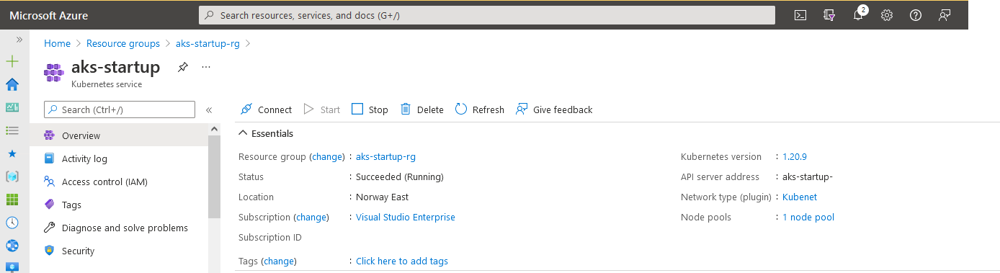
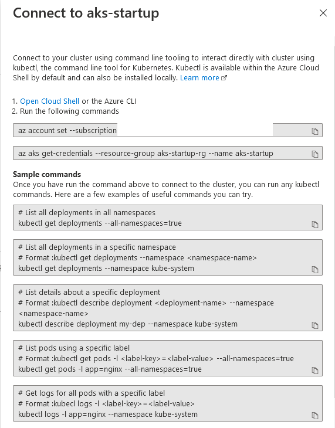

# Start AKS-Startup instansen #

Forhåndkrav:

- [Terraform oppsett](..\readme.md)

1 - Lag AKS instansen med Terraform

Kjør disse kommandoene i workspace containeren.

```bash
cd aks
az login
tf init
tf apply -input=false -auto-approve
```

## Koble kubectl til aks-startup ##

1 - Gå til Azure Portalen [https://portal.azure.com]
2 - Søk etter "**aks-startup**", og da finner du en **Kubernetes service**

Den ser typisk slik ut:



3 - Trykk på "**Connect**" og kjør kommandoene



Dette vil konfigurere din lokale "**kubectl**" installasjon og gjøre det mulig å snakke med **AKS-startup** instansen.

4 - List deployments i AKS-Startup

```bash
az login
az account set --subscription 22481158-8cb8-4597-be0c-4913204b4544
az aks get-credentials --resource-group aks-startup-rg --name aks-startup
kubectl get deployments --all-namespaces=true
```

- Bytt ut subscription med din egen. (Relax, subscription over finnes ikke.)
